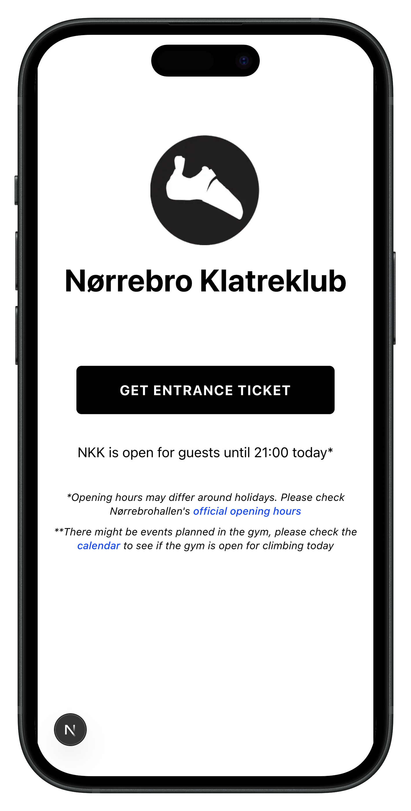

Entrance system for [Nørrebro Klatreklub](https://nkk.klub-modul.dk/default.aspx). Fully digital and automated!



## Getting Started

Set up environment variables in `.env`

Install dependencies
```bash
npm install
```

Run the development server:

```bash
npm run dev
```

Open [http://localhost:3000](http://localhost:3000) in your browser

## Tech Stack
- React
- Next.js
- Tailwind CSS
- [Frisbii](https://frisbii.com/) (payment gateway)
